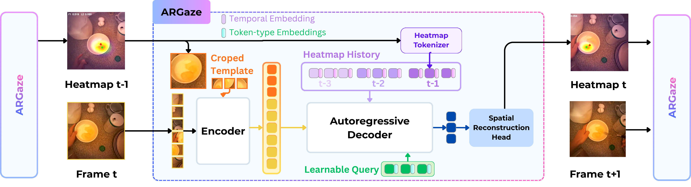

# Egocentric Gaze Estimation

[](https://arxiv.org/abs/2602.05132)

This repository contains the implementation of **DINOv3-based Autoregressive (AR) Gaze** models.


## Datasets Supported

The repository supports the following datasets:
-   **EGTEA Gaze+**
-   **Ego4D**
-   **EgoExo4D**

## Installation

### Prerequisites
The code requires a Linux environment with Python 3.8+ and PyTorch 2.0+.

### 1. Environment Setup (Follow DINOv3)

Follow the installation instructions from [DINOv3](https://github.com/facebookresearch/dinov3?tab=readme-ov-file#installation).
It is recommended to use `micromamba` to create the environment.

```bash
# Create and activate environment using micromamba
micromamba env create -f dinov3_env.yaml
micromamba activate argaze
```

### 2. ARGaze Setup

After setting up the `argaze` environment, clone this repository.

```bash
git clone https://github.com/yourusername/ARGaze.git
cd ARGaze
```

And follow the installation instructions from [GLC](https://github.com/BolinLai/GLC/blob/main/INSTALL.md) to install the dependencies.

## Data Preparation

Please refer to the dataset official websites for downloading the data.

```
EGTEA Gaze+: https://cbs.ic.gatech.edu/fpv/
Ego4D: https://ego4d-data.org/
EgoExo4D: https://ego-exo4d-data.org/
```

The expected directory structure for datasets is typically:

```
/path/to/datasets/
  ├── egtea/
  ├── ego4d/
  └── egoexo4d/
```

Update the `DATA.PATH_PREFIX` in your configuration files to point to your dataset location.

## Method Overview



## Results

<!-- Add results table/figure:  -->

*Results table coming soon.*

## Pretrained Checkpoints
*Other Pretrained Checkpoints coming soon.*

| Dataset | Model | Download |
|---|---|---|
| EGTEA Gaze+ | DINOv3_ARHeatmapGazeTemplate | [Google Drive](https://drive.google.com/file/d/1G7QNLgDgWP2psgJaT4V_32Pp5eHx62Ci/view?usp=sharing) |
| Ego4D | DINOv3_ARHeatmapGazeTemplate | *Coming soon* |
| EgoExo4D | DINOv3_ARHeatmapGazeTemplate | *Coming soon* |

## Usage

### Training

To train a model, use the `tools/run_net.py` script. Configuration files are located in `configs/`.

**Example: Training DINOv3 AR Heatmap Gaze on EGTEA**

```bash
python tools/run_net.py \
  --cfg configs/Egtea/DINOV3_ARHeatmapGazeTemplate.yaml \
  DATA.PATH_PREFIX /path/to/your/data \
  TRAIN.ENABLE True \
  TEST.ENABLE False \
  NUM_GPUS 1
```

### Evaluation

To evaluate a trained model:

```bash
python tools/run_net.py \
  --cfg configs/Egtea/DINOV3_ARHeatmapGazeTemplate.yaml \
  DATA.PATH_PREFIX /path/to/your/data \
  TRAIN.ENABLE False \
  TEST.ENABLE True \
  TEST.CHECKPOINT_FILE_PATH /path/to/checkpoint.pyth
```

### Streaming / Real-Time Inference

`tools/demo_streaming.py` runs **online gaze estimation** on a live webcam feed or a pre-recorded video using the `DINOv3_ARHeatmapGazeTemplate` model. It displays a JET heatmap overlay, a crosshair gaze marker, and live FPS.

#### Prerequisites

In addition to the base environment, OpenCV is required:

```bash
pip install opencv-python
```

#### Basic Usage


**Video file input**:

```bash
python tools/demo_streaming.py \
  --config configs/Egtea/DINOV3_ARHeatmapGazeTemplate.yaml \
  --checkpoint /path/to/checkpoint.pyth \
  --video /path/to/input.mp4
```

**Video file input with output saving**:

```bash
python tools/demo_streaming.py \
  --config configs/Egtea/DINOV3_ARHeatmapGazeTemplate.yaml \
  --checkpoint /path/to/checkpoint.pyth \
  --video /path/to/input.mp4 \
  --output /path/to/output.mp4
```


### Key Config Parameters

The most commonly overridden parameters via the command line:

| Parameter | Description | Example |
|---|---|---|
| `DATA.PATH_PREFIX` | Root directory of the dataset | `/path/to/egtea` |
| `TRAIN.ENABLE` | Enable training | `True` / `False` |
| `TEST.ENABLE` | Enable evaluation | `True` / `False` |
| `TEST.CHECKPOINT_FILE_PATH` | Path to checkpoint for evaluation | `/path/to/checkpoint.pyth` |
| `NUM_GPUS` | Number of GPUs to use | `1`, `4`, `8` |
| `TRAIN.BATCH_SIZE` | Training batch size per GPU | `8` |
| `SOLVER.BASE_LR` | Base learning rate | `1e-4` |
| `DATA.NUM_FRAMES` | Temporal window size (frames) | `8` |

## Tools

All runnable scripts are in the `tools/` directory:

| Script | Description |
|---|---|
| `run_net.py` | Main entry point for training and evaluation |
| `train_gaze_net.py` | Core training loop |
| `test_gaze_net.py` | Core evaluation loop with metric computation |
| `demo_streaming.py` | Real-time streaming inference from webcam or video |
| `visualize_error_clips.py` | Visualize high-error predictions for error analysis |

## Scripts

Useful scripts for training and ablation studies can be found in the `scripts/` directory.
-   `scripts/argaze/`: Contains organized scripts for different datasets and models.

## FAQ

**Q: CUDA out of memory during training.**
> Reduce `TRAIN.BATCH_SIZE` or `DATA.NUM_FRAMES` in the config, or use fewer GPUs with gradient accumulation.

**Q: `ModuleNotFoundError: No module named 'slowfast'`**
> Make sure you ran `pip install -e .` from the repo root, or that the repo root is on your `PYTHONPATH`.

**Q: `FileNotFoundError` for dataset annotations.**
> Check that `DATA.PATH_PREFIX` points to the correct root directory and that the annotation files exist under the expected structure.

**Q: Model predicts gaze at the same location every frame (degenerate output).**
> Ensure you are loading the correct checkpoint with `TEST.CHECKPOINT_FILE_PATH` and that the config matches the checkpoint.

**Q: `demo_streaming.py` shows "Buffering..." for a long time.**
> This is expected — the model requires `DATA.NUM_FRAMES` frames (default: 8) before the first prediction. Press `r` to reset the buffer if needed.

## Acknowledgements

This codebase builds upon the following excellent open-source projects:

-   [DINOv3](https://github.com/facebookresearch/dinov3) — Vision foundation model and environment setup
-   [GLC](https://github.com/BolinLai/GLC) — Global-Local Correlation gaze estimation framework
-   [SlowFast](https://github.com/facebookresearch/SlowFast) — Video understanding infrastructure
-   [PySlowFast](https://github.com/facebookresearch/SlowFast) — Config system and model builder

## License

This project is released under the [MIT License](LICENSE).

## Citation

If you find this code useful for your research, please cite:

```bibtex
@article{li2026argaze,
  title={ARGaze: Autoregressive Transformers for Online Egocentric Gaze Estimation},
  author={Li, Jia and Zhao, Wenjie and Deng, Shijian and Lai, Bolin and Wu, Yuheng and Chen, RUijia and Froehlich, Jon E and Zhao, Yuhang and Tian, Yapeng},
  journal={arXiv preprint arXiv:2602.05132},
  year={2026}
}
```